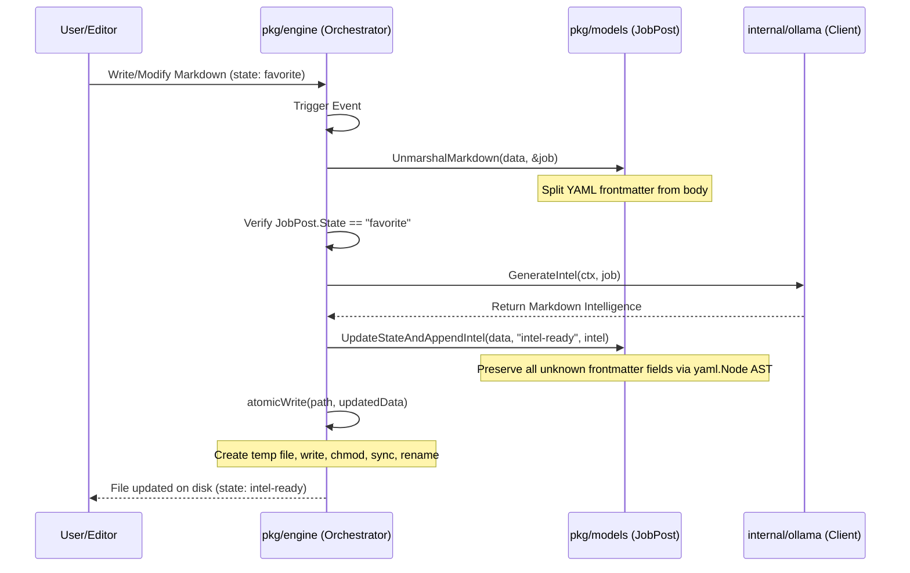

# The Forge: Architecture

This document describes the high-level architecture, directory layout, and data lifecycle of **The Forge**.

---

## 1. High-Level System Overview
The Forge is a local-first, event-driven career intelligence pipeline written in Go. Rather than relying on a centralized database, it treats the local filesystem—specifically an Obsidian Vault—as the state store.

Metadata and state transitions are tracked via YAML frontmatter in Markdown files, and the Obsidian interface serves as the primary user interface.

```mermaid
graph TD
    subgraph Filesystem (Obsidian Vault)
        A[Incoming Job Posting: state: new]
        B[Selected Job Posting: state: favorite]
        C[Enriched Job Posting: state: intel-ready]
    end

    subgraph The Forge Engine
        D[Recursive fsnotify Watcher]
        E[Job Post Parser / Serializer]
        F[Ollama Client]
    end

    A -->|User manual review| B
    B -->|File Event Trigger| D
    D -->|Read & Parse Frontmatter| E
    E -->|Extracted Job Data| F
    F -->|Run local LLM inference| E
    E -->|Atomic Write back to disk| C
```

---

## 2. Directory Layout & Package Responsibilities

*   `cmd/theforge/main.go`
    *   **Responsibility**: CLI entrypoint, loads configuration from `.env`, initializes background OS signal interception (`SIGINT`, `SIGTERM`), instantiates the Ollama client, and starts/stops the orchestrator lifecycle.
*   `internal/config/config.go`
    *   **Responsibility**: Loads configuration values, parses and validates environment variables (`OPENHUNT_OUTPUT_DIR`, `OLLAMA_API_URL`, `OLLAMA_MODEL`), resolves paths to absolute targets, and validates directory existence.
*   `internal/ollama/client.go`
    *   **Responsibility**: Implements the `IntelGenerator` interface. Wraps HTTP queries to the local Ollama API (specifically `/api/generate` default endpoint), sets generation parameters (like low temperature for predictability), constructs structured prompts, and cleans output code blocks.
*   `pkg/engine/orchestrator.go`
    *   **Responsibility**: Implements recursive filesystem directory watching via `fsnotify` and coordinates vault scanning. Listens for events on Markdown files, parses state criteria, calls the AI intelligence generator, and persists changes.
*   `pkg/models/job_post.go`
    *   **Responsibility**: Defines the core schema (`JobPost` struct). Provides helpers to separate YAML frontmatter metadata from the Markdown body (`splitMarkdown`), parses structures, and updates individual state properties using low-level YAML AST mapping.

---

## 3. Data Lifecycle & Enrichment Flow



### Key Safety Constraints:
1.  **Atomic Writing**: Writes never happen directly in-place. The application writes to a temporary file in the same directory, syncs to disk to guarantee persistence, and performs a native OS rename operation. This prevents truncation or corruption if the tool crashes or loses power during processing.
2.  **AST Manipulation**: Instead of marshaling the model struct back to YAML (which would erase custom, unknown YAML keys added by other plugins), the engine parses the YAML into a generic `yaml.Node` tree, edits only the `state` key, and marshals it back.
