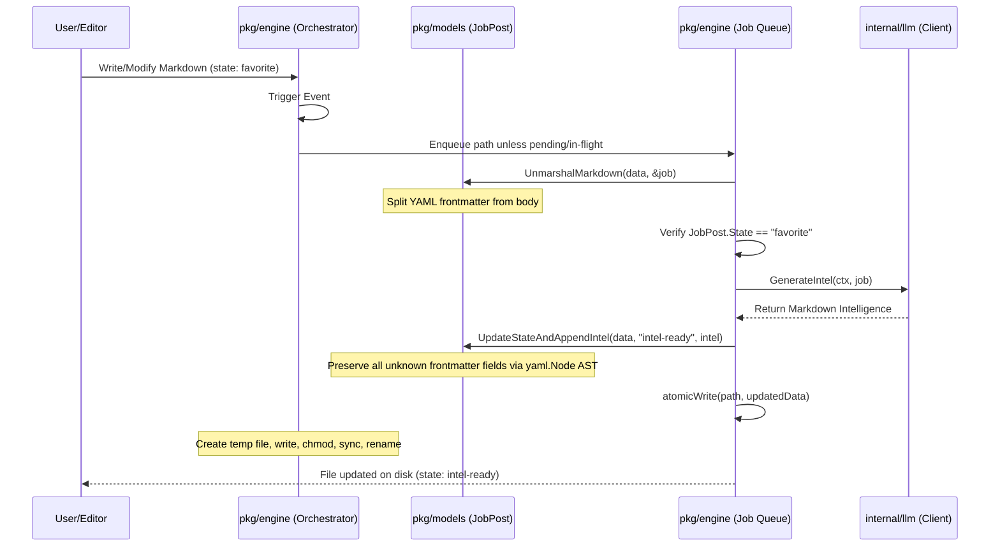

# The Forge: Architecture

This document describes the high-level architecture, directory layout, and data lifecycle of **The Forge**.

---

## 1. High-Level System Overview
The Forge is a local-first, event-driven career intelligence pipeline written in Go. Rather than relying on a centralized database, it treats the local filesystem—specifically an Obsidian Vault—as the state store.

Metadata and state transitions are tracked via YAML frontmatter in Markdown files, and the Obsidian interface serves as the primary user interface.

```mermaid
graph TD
    subgraph Filesystem (Obsidian Vault)
        A[Incoming Job Posting: state: new]
        B[Selected Job Posting: state: favorite]
        C[Enriched Job Posting: state: intel-ready]
    end

    subgraph The Forge Engine
        D[Recursive fsnotify Watcher]
        E[Job Post Parser / Serializer]
        F[LLM Provider Client]
    end

    A -->|User manual review| B
    B -->|File Event Trigger| D
    D -->|Read & Parse Frontmatter| E
    E -->|Extracted Job Data| F
    F -->|Generate intelligence| E
    E -->|Atomic Write back to disk| C
```

---

## 2. Directory Layout & Package Responsibilities

*   `cmd/theforge/main.go`
    *   **Responsibility**: CLI entrypoint, loads YAML/environment/dotenv configuration, initializes background OS signal interception (`SIGINT`, `SIGTERM`), obtains the selected LLM client, and starts/stops the orchestrator lifecycle.
*   `internal/config/config.go`
    *   **Responsibility**: Loads `theforge.yaml`, `.env`, and environment overrides; preserves Ollama defaults; records provider model and API-key environment variable names; resolves paths; and validates directory existence.
*   `internal/llm/client.go`
    *   **Responsibility**: Defines the provider-neutral client contract and selects Ollama, OpenAI, or Gemini. Ollama is the fully implemented default. OpenAI and Gemini are BYOK stubs that validate their selected key environment variable and return a clear not-implemented generation error.
*   `internal/ollama/client.go`
    *   **Responsibility**: Implements the provider-neutral client contract. Wraps HTTP queries to the local Ollama API (specifically `/api/generate` default endpoint), sets generation parameters (like low temperature for predictability), constructs structured prompts, and cleans output code blocks.
*   `pkg/engine/orchestrator.go`
    *   **Responsibility**: Implements recursive filesystem directory watching via `fsnotify` and coordinates vault scanning. The event loop enqueues Markdown paths while a worker parses state criteria, calls the provider-neutral intelligence generator, and persists changes. A pending/in-flight set coalesces event storms by filepath.
*   `pkg/models/job_post.go`
    *   **Responsibility**: Defines the core schema (`JobPost` struct). Provides helpers to separate YAML frontmatter metadata from the Markdown body (`splitMarkdown`), parses structures, and updates individual state properties using low-level YAML AST mapping.

---

## 3. Data Lifecycle & Enrichment Flow



### Key Safety Constraints:
1.  **Atomic Writing**: Writes never happen directly in-place. The application writes to a temporary file in the same directory, syncs to disk to guarantee persistence, and performs a native OS rename operation. This prevents truncation or corruption if the tool crashes or loses power during processing.
2.  **AST Manipulation**: Instead of marshaling the model struct back to YAML (which would erase custom, unknown YAML keys added by other plugins), the engine parses the YAML into a generic `yaml.Node` tree, edits only the `state` key, and marshals it back.
