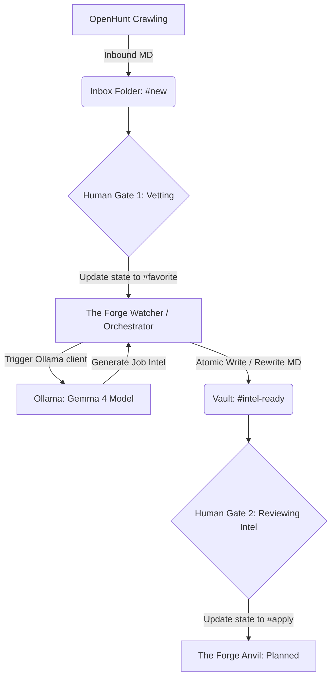

# The Forge: Context Map & Project Blueprint

This document preserves the context, architectural patterns, constraints, and current scope of **The Forge** repository.

## 1. Architecture & Tech Stack
The Forge is a local-first, event-driven career intelligence pipeline written in Go.

*   **State Management (Filesystem-as-Database)**: Uses the local filesystem—specifically an Obsidian Vault—as the primary state-driven database. State is stored in YAML frontmatter within Markdown files.
*   **Event-Driven Watching**: Uses `github.com/fsnotify/fsnotify` to watch the vault recursively for file modifications and creations.
*   **External Integration (Local AI)**: Interacts with a local **Ollama** server running the `gemma4:e4b` model (default) over HTTP (`/api/generate` endpoint) to enrich job postings with AI-generated intelligence.
*   **Core Dependencies**:
    *   `gopkg.in/yaml.v3` (for YAML parsing and AST manipulation to preserve comments/unrecognized keys)
    *   `github.com/fsnotify/fsnotify` (for filesystem event listening)
    *   Standard library (`net/http`, `os`, `path/filepath`, `context`, etc.)

---

## 2. Code Patterns & Style
Future changes must adhere strictly to these patterns:

*   **Formatting**: Strictly use `gofmt` on all modified files.
*   **File Isolation & Packages**:
    *   `cmd/theforge`: CLI entry point, configuration loading, signals orchestration.
    *   `internal/config`: Configurations and environment validation (`.env`).
    *   `internal/ollama`: Ollama client communicating via HTTP API.
    *   `pkg/engine`: Event loop, watcher, folder walker (`Orchestrator`).
    *   `pkg/models`: Structure and serialization/deserialization models (`JobPost`).
*   **AST Frontmatter Preservation**: Frontmatter updates are performed using `yaml.Node` to construct/modify mapping entries. This preserves existing, unknown fields, and file formatting upon writes.
*   **Atomic Write Pattern**: To prevent file truncation on write/power failure, files are written to a temporary file (`.filename.*.tmp`) in the same directory, verified, synced, and atomically renamed.
*   **Strict Evidence Rules**: Inventions of metrics, dates, or experience are strictly prohibited. Untracked experience is labeled as "transferable" or "gap".

---

## 3. Entry Points & Data Flow
1.  **CLI Entrypoint**: `cmd/theforge/main.go` parses config via `internal/config.Load()`, registers interrupt signals, creates the `ollama.Client`, and starts the `engine.Orchestrator`.
2.  **Orchestration Scan & Listen**:
    *   **Initial Scan**: Walks `OPENHUNT_OUTPUT_DIR` recursively and triggers `handleFile` for any Markdown file containing `state: favorite` or `favorite: true`.
    *   **Live Watch**: Spawns a background goroutine monitoring FS events. When a `.md` file is written, created, or renamed, or if a new directory is created, it updates watches and processes files.
3.  **Process Flow**:
    `Orchestrator.handleFile(path)` $\rightarrow$ Reads $\rightarrow$ Unmarshals $\rightarrow$ Filter (`state == "favorite"`) $\rightarrow$ Call `IntelGenerator.GenerateIntel()` $\rightarrow$ Update frontmatter to `state: intel-ready` $\rightarrow$ Atomic write.

---

## 4. Edge Cases, Risks & Constraints
*   **Watcher Noise & Duplicate Events**: Filesystem watchers are noisy. Event handlers must act idempotently (e.g. skipping jobs already marked `intel-ready`).
*   **Ollama Client Timeout & Failures**: Ollama runs locally and can be slow or unavailable. The client uses a 5-minute timeout and accepts a `context.Context` to handle graceful shutdown.
*   **Partial Writes & Retries**: Temporary files during atomic write prevent vault corruption, but recursive watch triggers on rename/write must be handled cleanly.
*   **Testing Discipline**: Tests must use temporary folders (`t.TempDir()`). Never point tests at a real Obsidian vault.
