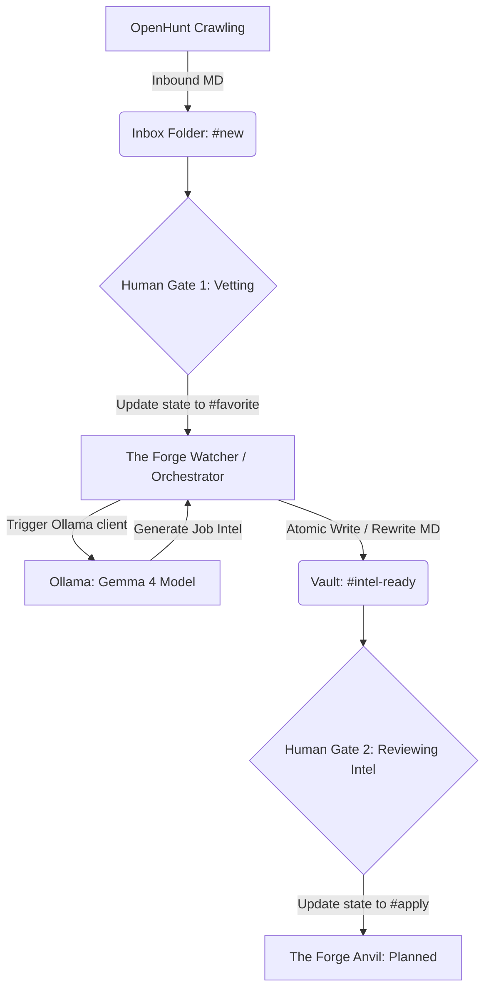

# The Forge: Context Map & Project Blueprint

This document preserves the context, architectural patterns, constraints, and current scope of **The Forge** repository.

## 1. Architecture & Tech Stack
The Forge is a local-first, event-driven career intelligence pipeline written in Go.

*   **State Management (Filesystem-as-Database)**: Uses the local filesystem—specifically an Obsidian Vault—as the primary state-driven database. State is stored in YAML frontmatter within Markdown files.
*   **Event-Driven Watching**: Uses `github.com/fsnotify/fsnotify` to watch the vault recursively for file modifications and creations.
*   **External Integration (Local AI)**: Interacts with a local **Ollama** server running the `gemma4:e4b` model (default) over HTTP (`/api/generate` endpoint) to enrich job postings with AI-generated intelligence.
*   **Core Dependencies**:
    *   `gopkg.in/yaml.v3` (for YAML parsing and AST manipulation to preserve comments/unrecognized keys)
    *   `github.com/fsnotify/fsnotify` (for filesystem event listening)
    *   Standard library (`net/http`, `os`, `path/filepath`, `context`, etc.)

---

## 2. Code Patterns & Style
Future changes must adhere strictly to these patterns:

*   **Formatting**: Strictly use `gofmt` on all modified files.
*   **File Isolation & Packages**:
    *   `cmd/theforge`: CLI entry point, configuration loading, signals orchestration.
    *   `internal/config`: Configurations and environment validation (`.env`).
    *   `internal/ollama`: Ollama client communicating via HTTP API.
    *   `pkg/engine`: Event loop, watcher, folder walker (`Orchestrator`).
    *   `pkg/models`: Structure and serialization/deserialization models (`JobPost`).
*   **AST Frontmatter Preservation**: Frontmatter updates are performed using `yaml.Node` to construct/modify mapping entries. This preserves existing, unknown fields, and file formatting upon writes.
*   **Atomic Write Pattern**: To prevent file truncation on write/power failure, files are written to a temporary file (`.filename.*.tmp`) in the same directory, verified, synced, and atomically renamed.
*   **Strict Evidence Rules**: Inventions of metrics, dates, or experience are strictly prohibited. Untracked experience is labeled as "transferable" or "gap".

---

## 3. Entry Points & Data Flow
1.  **CLI Entrypoint**: `cmd/theforge/main.go` parses CLI arguments (`run` command and flags: `--tier`, `--vault`, `--concurrency`, `--provider`, `--model`), overrides default `.env` / `theforge.yaml` settings, registers interrupt signals, and starts the `engine.Orchestrator`.
2.  **Ollama Verification**: On startup, `NewClient` verifies the local model availability using a 2-second timeout request to `/api/tags` and logs warnings if missing.
3.  **Orchestration Scan & Listen**:
    *   **Initial Scan**: Walks the vault directory recursively and queues files matching the selected tier filter.
    *   **Live Watch**: Watches for `.md` creations, modifications, and renames recursively.
4.  **Funnel State Matching**:
    *   **Local Tier (`local`)**: Filters `new`/`""` -> processes locally via Ollama to extract core signals -> transitions state to `processed`.
    *   **Frontier Tier (`frontier`)**: Filters `favorite` -> processes via premium API (Gemini/OpenAI) to perform deep synthesis -> transitions state to `intel-ready`.
    *   **Auto Tier (`auto`)**: Automatically coordinates both local and frontier transitions.
5.  **Process Flow**:
    `Orchestrator.handleFile(path)` $\rightarrow$ Reads $\rightarrow$ Unmarshals $\rightarrow$ Filter state and tier $\rightarrow$ Optimize VRAM (unload conflicting models via `/api/ps` and `keep_alive: 0`) $\rightarrow$ Call `IntelGenerator.GenerateIntel()` with context tier value $\rightarrow$ Overwrite existing `The Forge Intelligence` section $\rightarrow$ Atomic write.

---

## 4. Edge Cases, Risks & Constraints
*   **Watcher Noise & Duplicate Events**: Filesystem watchers are noisy. Event handlers coalesce duplicates and check states idempotently before processing.
*   **Ollama Client Timeout & Failures**: Ollama runs locally and can be slow/stuck. The client uses a circuit breaker (tripping after 3 failures with a cooldown) and a 60-second request timeout limit.
*   **VRAM Swapping Latency**: Swapping active models on limited hardware introduces latency. The manager unloads conflicting active models prior to local runs to prevent system thrashing.
*   **Testing Discipline**: Tests must use temporary folders (`t.TempDir()`). Never point tests at a real Obsidian vault.
