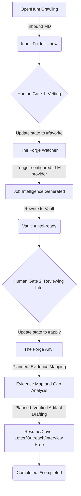

```text
  _______ _    _ ______   ______ ____  _____   _____ ______ 
 |__   __| |  | |  ____| |  ____/ __ \|  __ \ / ____|  ____|
    | |  | |__| | |__    | |__ | |  | | |__) | |  __| |__   
    | |  |  __  |  __|   |  __|| |  | |  _  /| | |_ |  __|  
    | |  | |  | | |____  | |   | |__| | | \ \| |__| | |____ 
    |_|  |_|  |_|______| |_|    \____/|_|  \_\\_____|______|
                                                            
```

# The Forge

**The Forge** is a local-first, event-driven career intelligence system written in Go. It supports ethical, evidence-based AI-assisted job application workflows by using the local filesystem--specifically an Obsidian vault--as its primary state-driven database.

## Project Overview

The Forge monitors your Obsidian vault for job postings ingested by "OpenHunt". It tracks the lifecycle of each selected application through frontmatter metadata, triggering an LLM provider to generate job intelligence and, in planned phases, traceable evidence maps and targeted application artifacts. **Ollama** running **Gemma 4** remains the default local provider, so the normal workflow requires no paid API key.

The Forge is not a generic resume generator and is not intended for application spam. Its product direction is quality over volume: help candidates apply to fewer roles with stronger precision, stronger verified evidence, and better preparation.

## Core Principle

Invention of candidate experience is strictly forbidden.

Agents may reframe, emphasize, summarize, and tailor verified evidence. They must never fabricate employers, roles, dates, metrics, technologies, certifications, education, clearance status, citizenship, accomplishments, production experience, or any other candidate fact. If a job requirement is not supported by the candidate knowledge base, The Forge must identify it as a gap or transferable skill rather than claim direct experience.

## Source of Truth

Application materials should be generated only from verified source material:

- Master resume
- Achievement inventory
- Project portfolio
- Certifications
- GitHub/project evidence
- Writing samples
- Candidate preferences
- Job description

## Evidence Rules

- Every generated resume bullet must map back to one or more source facts.
- Metrics may only be used when explicitly present in source material.
- Approximate or inferred claims must be labeled internally and must not appear as hard facts.
- Transferable experience is allowed only when clearly framed as transferable.
- Concrete evidence is preferred over keyword stuffing.

For example, if a job description asks for AWS but the verified candidate knowledge base only shows GCP, Kubernetes, and Terraform experience, The Forge must not claim AWS production experience. It should frame cloud infrastructure skills as transferable and mark AWS as a gap until verified. If source material lacks a metric, The Forge must not invent percentages, dollar amounts, team sizes, uptime, or incident reduction numbers.

## 3-Phase Architecture

The following diagram illustrates the data flow and human gates within The Forge:



The currently implemented processor performs the `favorite` to `intel-ready` intelligence step. Evidence maps, tailored resumes, cover letters, recruiter messages, interview prep guides, requirement match/gap analysis, and candidate follow-up questions are part of the product model and planned artifact workflow.

## Project Structure

```text
.
├── DESIGN.md              # High-level architecture and design philosophy
├── LICENSE                # MIT License
├── README.md              # Project documentation
├── cmd
│   └── theforge
│       └── main.go        # CLI startup and signal handling
├── go.mod                 # Go module definition
├── go.sum                 # Go module checksums
├── internal
│   ├── config
│   │   └── config.go      # YAML, environment, and .env configuration
│   ├── llm
│   │   └── client.go      # Provider-neutral client and factory
│   └── ollama
│       └── client.go      # Default local Ollama implementation
└── pkg
    ├── engine
    │   └── orchestrator.go # Vault watching and orchestration logic
    └── models
        └── job_post.go     # Core JobPost struct and Markdown/YAML parsing
```

## How State Management Works

The Forge implements a "Filesystem-as-Database" pattern. Instead of an external database like PostgreSQL or MongoDB, the system relies on the YAML frontmatter inside your Markdown files:

1.  **State Detection**: The `Orchestrator` uses `fsnotify` to watch for file changes in the Obsidian vault.
2.  **Schema Enforcement**: When a file is modified, The Forge unmarshals the YAML frontmatter into a `JobPost` struct.
3.  **Reactive Transitions**: If the `state` field or `favorite` boolean matches certain criteria (e.g., `state: "favorite"`), the engine triggers the corresponding Phase.
4.  **Persistence**: After processing, The Forge updates the struct's `state` (e.g., to `intel-ready`) and marshals it back into the Markdown file, preserving your content while updating the metadata.

This ensures that Obsidian remains the source of truth and the primary UI for the pipeline.

## Running The Forge

Create `.env` from the committed example and set it to the directory where OpenHunt writes Markdown files:

```sh
cp .env.example .env
```

Start the watching and processing pipeline using the `run` subcommand or by running the CLI directly:

```sh
go run ./cmd/theforge run
```

### CLI Command & Flags

The Forge supports several command-line flags to customize execution at startup. These flags override values specified in environment variables or `theforge.yaml`:

*   **`-tier <tier>`**: Configures the multi-tier funnel processing behavior. Allowed values:
    *   `local`: Processes raw postings (`state: new` or empty with no favorite tag) and extracts core signals using local compute, transitioning them to `state: processed`.
    *   `frontier`: Processes only favorited postings (`state: favorite` or favorited tag), performing deep intelligence enrichment using premium/frontier models, transitioning them to `state: intel-ready`.
    *   `auto` *(Default)*: Automatically handles both paths in parallel. It pre-processes new postings (`new` -> `processed`) and enriches favorited ones (`favorite` -> `intel-ready`).
*   **`-vault <path>`**: Overrides the path to the Obsidian vault / OpenHunt output directory (maps to `OPENHUNT_OUTPUT_DIR`).
*   **`-concurrency <number>`**: Overrides the number of concurrent workers.
*   **`-provider <provider>`**: Overrides the LLM provider (e.g., `ollama`, `openai`, `gemini`).
*   **`-model <model>`**: Overrides the target LLM model.

For example, to run only the local pre-processing tier with a custom vault path and concurrency limit:

```sh
go run ./cmd/theforge run -tier local -vault "/path/to/your/Obsidian/Vault" -concurrency 8
```

To run deep intelligence synthesis on favorited listings using a specific provider and model:

```sh
go run ./cmd/theforge run -tier frontier -provider openai -model gpt-4o
```

To run the automated multi-tier funnel (processing new listings locally and favorited listings via frontier model) on a specific vault directory:

```sh
go run ./cmd/theforge run -vault "/path/to/your/Obsidian/Vault" -tier auto
```

The default configuration selects local Ollama at `http://localhost:11434` with `gemma4:e4b`; no OpenAI, Gemini, or paid API key is required. The existing `OLLAMA_API_URL` and `OLLAMA_MODEL` variables remain supported.

Provider settings can optionally be kept in `theforge.yaml`:

```sh
cp theforge.yaml.example theforge.yaml
```

```yaml
llm:
  provider: ollama
  model: gemma4:e4b
providers:
  ollama:
    host: http://localhost:11434
    model: gemma4:e4b
  openai:
    api_key_env: OPENAI_API_KEY
    model: gpt-4.1-mini
  gemini:
    api_key_env: GEMINI_API_KEY
    model: gemini-2.5-flash
```

Environment variables override YAML. Use `LLM_PROVIDER` and optional `LLM_MODEL` to select a provider and model.

### Using Your Own API Key

OpenAI and Gemini use bring-your-own-key environment variables. Do not put the key itself in `theforge.yaml`, `.env.example`, source code, or any committed file. Export the key in the shell that starts The Forge.

For OpenAI:

```sh
export OPENAI_API_KEY="your-openai-api-key"
export LLM_PROVIDER="openai"
export LLM_MODEL="gpt-4.1-mini"
go run ./cmd/theforge
```

For Gemini:

```sh
export GEMINI_API_KEY="your-gemini-api-key"
export LLM_PROVIDER="gemini"
export LLM_MODEL="gemini-2.5-flash"
go run ./cmd/theforge
```

The `api_key_env` setting names the environment variable to read; it is not the key. For example, `api_key_env: MY_OPENAI_KEY` requires `export MY_OPENAI_KEY="..."`. Missing keys produce an error only when their provider is selected.

OpenAI and Gemini currently have configuration and key-validation stubs only. After successful selection they return a clear error that HTTP generation is not implemented. Ollama is the only fully implemented provider and remains the default local mode with no paid API key required.

Before The Forge will process an incoming OpenHunt note, mark it as selected by adding this field inside its YAML frontmatter:

```yaml
state: favorite
```

For example:

```yaml
---
job_id: JR333947
company: Salesforce
title: DevOps Engineer, GovCloud Mid/Senior
state: favorite
---
```

Notes without `state: favorite` are intentionally ignored. This is the human approval gate that prevents every scraped posting from being sent to the configured provider. After successful intelligence generation, The Forge replaces the value with `state: intel-ready`.

The CLI loads optional `theforge.yaml` and `.env` files from the current working directory, applies exported environment variables as overrides, validates that the configured output path is a directory, performs the initial scan, and watches until interrupted with `Ctrl-C` or a termination signal.

The current processor queues matching `favorite` jobs for the configured provider, appends a `The Forge Intelligence` section, and changes their state to `intel-ready`. Duplicate filesystem events for a queued or in-flight path are coalesced. The active prompt asks for role signals, evidence needs, transferable positioning, gaps, unsupported claims, candidate follow-up questions, and interview themes. Application artifact generation remains planned functionality and must use verified evidence maps before producing candidate-facing materials.

## Authors & Licensing

- **Author:** Adam Deane
- **License:** MIT License (see [LICENSE](LICENSE) for details)
