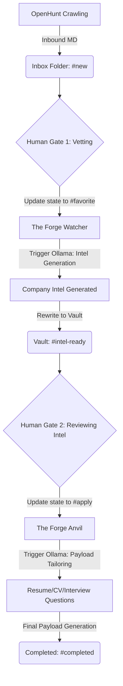

```text
 _________  ___  ___  _______           _______   ________  ________  ________  _______      
|\___   ___\\  \|\  \|\  ___ \         |\  ___ \ |\   __  \|\   __  \|\   ____\|\  ___ \     
\|___ \  \_\ \  \\\  \ \   __/|        \ \   __/|\ \  \|\  \ \  \|\  \ \  \___|\ \   __/|    
     \ \  \ \ \   __  \ \  \_|/__       \ \  \_|/_\ \  \\\  \ \   _  _\ \  \  __\ \  \_|/__  
      \ \  \ \ \  \ \  \ \  \_|/__       \ \  \_|\ \ \  \\\  \ \  \\  \\ \  \|\  \ \  \_|/__ 
       \ \__\ \ \__\ \__\ \_______\       \ \_______\ \_______\ \__\\ _\\ \_______\ \_______\
        \|__|  \|__|\|__|\|_______|        \|_______|\|_______|\|__|\|__|\|_______|\|_______|
                                                                                             
```

# The Forge

**The Forge** is a local-first, event-driven AI orchestration pipeline written in Go. It is designed to bridge the gap between automated job scraping and personalized application generation by using the local filesystem—specifically an Obsidian vault—as its primary state-driven database.

## Project Overview

The Forge monitors your Obsidian vault for job postings ingested by "OpenHunt". It tracks the lifecycle of each application through frontmatter metadata, triggering local AI processing via **Ollama** (running the **Gemma 4** model) to generate company intelligence and tailored career payloads (resumes, cover letters, etc.).

By treating the filesystem as a state machine, The Forge allows for a seamless "human-in-the-loop" workflow where simple edits in Obsidian drive complex AI-powered background tasks.

## 3-Phase Architecture

The following diagram illustrates the data flow and human gates within The Forge:



## Project Structure

```text
.
├── DESIGN.md              # High-level architecture and design philosophy
├── LICENSE                # MIT License
├── README.md              # Project documentation
├── go.mod                 # Go module definition
├── go.sum                 # Go module checksums
└── pkg
    ├── engine
    │   └── orchestrator.go # Vault watching and orchestration logic
    └── models
        └── job_post.go     # Core JobPost struct and Markdown/YAML parsing
```

## How State Management Works

The Forge implements a "Filesystem-as-Database" pattern. Instead of an external database like PostgreSQL or MongoDB, the system relies on the YAML frontmatter inside your Markdown files:

1.  **State Detection**: The `Orchestrator` uses `fsnotify` to watch for file changes in the Obsidian vault.
2.  **Schema Enforcement**: When a file is modified, The Forge unmarshals the YAML frontmatter into a `JobPost` struct.
3.  **Reactive Transitions**: If the `state` field or `favorite` boolean matches certain criteria (e.g., `state: "favorite"`), the engine triggers the corresponding Phase.
4.  **Persistence**: After processing, The Forge updates the struct's `state` (e.g., to `intel-ready`) and marshals it back into the Markdown file, preserving your content while updating the metadata.

This ensures that Obsidian remains the source of truth and the primary UI for the pipeline.

## Authors & Licensing

- **Author:** Adam Deane
- **License:** MIT License (see [LICENSE](LICENSE) for details)
