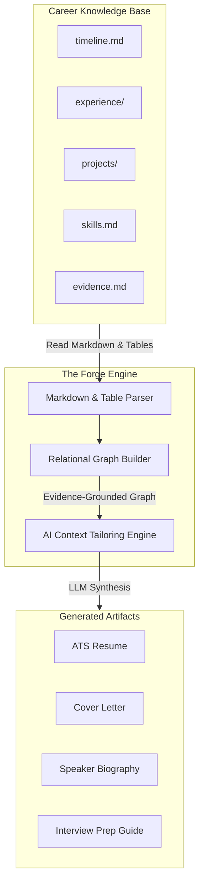

# Career Knowledge Base (CKB)

The Career Knowledge Base (CKB) is the canonical, lifelong, version-controlled source of truth for an individual's professional history. 

This repository serves as a foundational subsystem of the Forge architecture. Every career artifact generated by the Forge—whether a resume, cover letter, LinkedIn profile, or custom interview preparation guide—is derived entirely from this single source of truth.

---

## 1. Vision & Core Philosophy

### What is the Career Knowledge Base?
The CKB is to a career what a Git repository is to source code. Rather than maintaining multiple disconnected, static documents (like separate resumes for different roles or industries), you maintain a single, highly structured, relational database of Markdown files. 

From this core database, a compiler or generator (such as The Forge) can build and target any needed format:
*   ATS-optimized Resumes (1-page, 2-page, Executive)
*   Curriculum Vitae (CV)
*   LinkedIn and Professional Biographies (Executive, Speaker, Conference)
*   Cover Letters and Recruiter Summaries
*   Interview Preparation Packs (STAR stories, Gap analysis)
*   Promotion Packets & Performance Reviews
*   Skill Matrices & Portfolios

### Why Markdown?
Markdown was selected for its long-term stability and compatibility:
1.  **Human Readable**: Markdown is easily readable and editable in any standard text editor (such as Obsidian, VS Code, or Notepad). It puts the user in direct ownership of their data without requiring proprietary software.
2.  **Version Controlled & Diffable**: Standard git diffs work natively on Markdown. Changes to your career history are easily tracked, branched, and reviewed over years.
3.  **AI Friendly**: LLMs parse Markdown text and tables natively with high fidelity, reducing token overhead and structural errors.
4.  **Extensible**: Markdown supports embedding YAML blocks, Markdown tables, HTML anchors, and links, allowing the creation of complex relational networks between documents.

### Version Control Matters
Your career is not static. Version control allows you to:
*   Track the evolution of projects and roles over decades.
*   Tag specific releases (e.g., `v2026.07-senior-engineer`).
*   Create feature branches to test positioning adjustments or additions before merging them into your main timeline.

---

## 2. Privacy Philosophy

The CKB core schema and template files committed to version control must contain **zero personally identifiable information (PII)**. 

### Excluded Data Types:
*   Names, physical addresses, email addresses, and phone numbers.
*   Social security numbers or government identifiers.
*   Real company names, real school names, or real dates tied to a specific person.
*   Direct links to personal social media (unless they are fictional mock links).

All templates and repository examples must use fictional details (e.g., `Stark Industries`, `University of Metropolis`, or generic placeholder tokens). The CKB module should be completely safe to publish publicly or share as open-source configurations. A user's actual career data lives in their private, local Obsidian vault outside of public version control.

---

## 3. The AI & Evidence Philosophy

A core problem with existing AI resume writers is **hallucination**. LLMs routinely invent metrics, fabricate technologies, and exaggerate responsibilities to fit a job posting. 

The Forge and the CKB operate under a strict **Evidence-First** constraint:
1.  **Strict Grounding**: The AI is prohibited from inventing experience. Every bullet point or professional claim must be derived from verified entries in the CKB.
2.  **The Evidence Graph**: Experience is backed by first-class **Evidence** objects (e.g., pull requests, design documents, architecture specs, metrics, performance reviews).
3.  **Transferable over Fabricated**: If a job description lists a requirement not explicitly present in the CKB, the system frames it as a transferable skill or identifies it as a gap rather than inventing experience.

---

## 4. Integration with The Forge

The CKB is consumed by The Forge as structured relational data:

*   **Extraction**: The Forge parses CKB markdown tables and file references, resolving connections (e.g., mapping a skill to a project and its supporting git evidence).
*   **Vectorization**: Documents can be indexed into a local vector store for semantic similarity queries against job postings.
*   **Target Compilation**: The Forge extracts only the relevant, verified nodes from the graph to build the customized resume.
