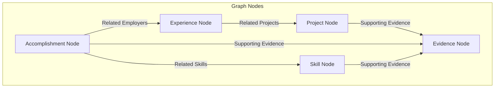

# CKB Integration & Graph Consumer Guide

Future Forge modules (such as the Resume Tailor or Interview Prep Packager) consume the Career Knowledge Base (CKB) as a structured relational graph database. This document provides implementation guidelines for developers writing parser and search algorithms for the CKB.

---

## 1. Relational Mapping Strategy

The CKB is parsed by reading Markdown tables and links to construct a graph where:
*   **Nodes**: Experience, Projects, Skills, Accomplishments, Certifications, and Evidence.
*   **Edges**: Defined by Markdown links, cross-reference tables, and lists.



---

## 2. Table Parsing Heuristics

All files use Markdown tables for metadata and listings. The parser must follow these rules:

1.  **Metadata Extraction**: 
    *   The first Markdown table in any file is treated as the **Metadata Block**.
    *   The parser should read key-value pairs (first column as Key, second column as Value).
    *   Fields must map to the models defined in `schema.md`.
2.  **Relational Link Parsing**:
    *   Markdown links (e.g. `[Anchor](../projects/example-project.md#project-titan)`) must be parsed to extract the target path and header anchor.
    *   Links represent relational edges. For example, if an Accomplishment contains `[Project Titan](./projects/example-project.md#project-titan)` under `Related Projects`, the parser creates a directed edge `Accomplishment -> Project:Titan`.

---

## 3. Grounding & Anti-Hallucination Audits

Before downstream modules generate any output (like a resume bullet), the **Hallucination Auditor** must verify the claims against the parsed CKB graph:

```
        Claim: "Reduced database scale costs by $1.2M annually"
                                │
                                ▼
         Is this claim linked to an Accomplishment/Project?
                                │
                      ┌─────────┴─────────┐
                      ▼ Yes               ▼ No
        Find linked Evidence Node    [REJECT CLAIM]
                      │
            ┌─────────┴─────────┐
            ▼                   ▼
    Is Verification Level   Is Verification Level
    "Verified" or "Peer"?   "Unverified"?
            │                   │
            ▼                   ▼
     [APPROVE CLAIM]     [FLAG WARNING / REQUEST RE-CHECK]
```

*   **Rule**: Any generated bullet point must be trace-linkable to an Evidence Node.
*   **Warning**: If a claim's supporting evidence is `Unverified`, the generator must append a warning or ask the candidate to confirm the detail before final packaging.
*   **Rejection**: If a claim lacks any corresponding CKB node (e.g. the LLM inferred or invented experience), it must be stripped from the final artifact.
