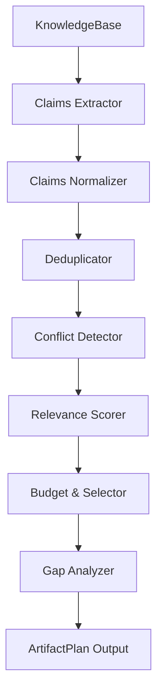

# Career Knowledge Base (CKB) Planning Engine Specification

This document details the architecture, design policies, scoring heuristics, and execution sequence of the Phase 3A evidence-aware Planning Engine.

---

## 1. Core Architecture

The Planning Engine transforms raw candidate experience data stored in the strongly-typed CKB model into a structured, deterministic `ArtifactPlan`. This plan serves as a roadmap for downstream prose generation engines (e.g., résumé writers or biography generators).

---

## 2. Eligibility & Visibility Policies

Claims are filtered using predefined compliance policies. If a claim does not satisfy the active policy criteria, it is marked as **Ineligible** and added to the `ExcludedClaims` section of the plan.

### Predefined Policies

1. **StrictPublic**:
   - `MinVerification`: `Self-Attested`
   - `MinConfidence`: `0.80`
   - `AllowedVisibilities`: `[Public]`
   - `ExcludeDisputed`: `true`
   - `ExcludeSuperseded`: `true`

2. **ComprehensiveCV**:
   - `MinVerification`: `Unverified`
   - `MinConfidence`: `0.50`
   - `AllowedVisibilities`: `[Public, Internal]`
   - `ExcludeDisputed`: `true`
   - `ExcludeSuperseded`: `true`

3. **InterviewPrep**:
   - `MinVerification`: `Unverified`
   - `MinConfidence`: `0.00`
   - `AllowedVisibilities`: `[Public, Internal, Confidential]`
   - `ExcludeDisputed`: `true`
   - `ExcludeSuperseded`: `false`

4. **InternalRecord**:
   - `MinVerification`: `Unverified`
   - `MinConfidence`: `0.00`
   - `AllowedVisibilities`: `[Public, Internal, Confidential]`
   - `ExcludeDisputed`: `false`
   - `ExcludeSuperseded`: `false`

---

## 3. Relevance Scoring

Skill claims are extracted from canonical skill matrix tables by matching the `Skill Name` header and optional supported columns such as `Proficiency`, `Confidence`, `Years`, `Last Used`, `Related Experience`, `Related Projects`, and `Supporting Evidence`. Duplicate skill names within a skill object keep the first row in deterministic section order.

Credential claims are extracted from H3 credential headings under credential category sections. H2 category headings such as `Professional Certifications` and `Professional Training Log` are containers only and are not emitted as credential claims.

Relevance scores (0–100) are computed dynamically using a deterministic scoring formula:

1. **Base Score**: `50`
2. **Skill Match Boost (+15)**: Added if any technical skill or technology requested by the target profile is matched in the claim's statement, value, or tags.
3. **Role Match Boost (+15)**: Added if the target role title or role family is found in the role name or statement.
4. **Recency Boost (+10)**: Added if the claim has an ongoing duration or is within the target profile's recency threshold (defaults to 3 years).
5. **Evidence Strength (+10)**: Added for `Independently-Verified` or `Artifact-Supported` verification levels.
6. **Visibility Penalty (-10)**: Deducted if the claim is marked `Confidential` or `Internal`.
7. **Conflict Penalty (-20)**: Deducted if the claim is involved in a date overlap, title mismatch, or metric mismatch.

---

## 4. Selection, Budgeting & Segmenting

Selected claims are structured into sections according to the target artifact type. High-scoring claims are budgeted to prevent overruns:

- **OnePageResume**:
  - Max 3 unique roles.
  - Max 4 accomplishments/measurable results per selected role.
  - Max 10 skills.
  - Max 2 education degrees.
- **FullCV**:
  - Unlimited.
- **ProfessionalBiography**:
  - Max 2 objectives/roles.
  - Max 3 accomplishments/milestones.

---

## 5. Gap & Chronology Analysis

After budgeting, the planner scans the selected claims and target profiles to identify gaps, appending warnings to the plan:

- **CKB-PLAN-TARGET-GAP**:
  - Missing target skills or technologies.
  - Accomplishments selected without supporting quantifiable metrics.
  - Chronology Gaps: Employment gaps greater than 6 months.

---

## 6. Provenance & Serialization

Every selected claim is mapped to a `ProvenanceRecord` containing its exact source file path, line number, verification metadata, and authorized evidence IDs. The planner is the authorization boundary for evidence references: unresolved, malformed, wrong-type, policy-restricted, below-threshold verification, superseded, disputed, draft, deprecated, or archived evidence IDs are removed before selection and rendering. Public policies fail closed and exports include only resolved, policy-permitted evidence IDs. Evidence optionality affects claim eligibility after this filtering; it never permits unsafe evidence identifiers to remain in public output. The output is exported using a deterministic JSON serializer ensuring byte-identical outputs across successive runs.
